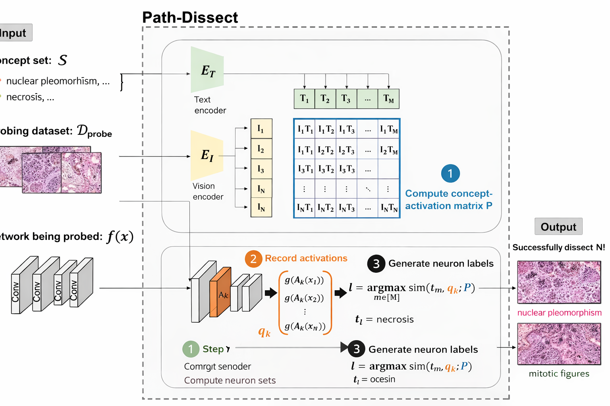

# path-dissect


*Adapted from CLIP-Dissect*

A fork of [CLIP-Dissect](https://github.com/Trustworthy-ML-Lab/CLIP-dissect) adapted for computational pathology. Replaces OpenAI CLIP with pathology-specific vision-language models (CONCH, PLIP) to automatically label neurons of a target pathology model using natural language concepts.

The target model is a Concept Bottleneck Model (CEM) trained on TCGA survival prediction. Its concept bottleneck neurons are matched to pathology concepts by comparing their activation patterns across slides to VLM image-concept similarity scores.

---

## Supported models

| Role | Model | Notes |
|------|-------|-------|
| VLM (reference) | CONCH | Recommended — pathology-native, 448×448 |
| VLM (reference) | PLIP | Alternative |
| VLM (reference) | CLIP ViT-B/16 | General-purpose baseline |
| Target model | CEM (UNI + attention + bottleneck) | Survival prediction on TCGA |

---

## Setup

```bash
pip install torch torchvision timm transformers tqdm pandas scipy
# CONCH: install from https://github.com/mahmoodlab/CONCH
```

---

## Running the pipeline

**1. Generate VLM slide embeddings** (once per tile set):
```bash
PYTHONPATH=. python scripts/generate_conch_embeddings.py \
  --checkpoint /path/to/conch/pytorch_model.bin --device cuda

PYTHONPATH=. python scripts/generate_plip_embeddings.py --device cuda

PYTHONPATH=. python scripts/generate_clip_embeddings.py --device cuda
```

**2. Run dissection:**
```bash
PYTHONPATH=. python scripts/describe_neurons.py \
  --clip_model conch \
  --target_model cem \
  --concept_set concept_sets/pathology_concepts_combined.txt \
  --conch_checkpoint /path/to/conch/pytorch_model.bin \
  --device cuda
```

Results are saved to `results/{target_model}_{timestamp}/descriptions.csv`.

**3. Plot top concepts per neuron:**
```bash
PYTHONPATH=. python scripts/plot_top_concepts.py \
  --concept_set concept_sets/pathology_concepts_combined.txt \
  --vlm conch
```

---

## Concept sets

Concept sets are plain text files (one concept per line) in `concept_sets/`. They define the vocabulary of natural language descriptions matched to neurons.

| File | Concepts | Source | Description |
|------|----------|--------|-------------|
| `pathology_concepts_combined.txt` | ~14,500 | NCIt, HPO, TCGA diagnostic reports, hand-curated | Recommended — broadest coverage |
| `pathology_focused.txt` | 1,895 | NCIt, HPO | Filtered to TCGA-relevant cancer types; excludes haematological, CNS, sarcoma |
| `curated_concepts.txt` | 126 | Hand-curated | Useful for quick tests; too small for production runs |

Use sentence-style concepts (e.g. `invasive ductal carcinoma`, `nuclear pleomorphism`) rather than single keywords — both CONCH and PLIP were trained on captions.
